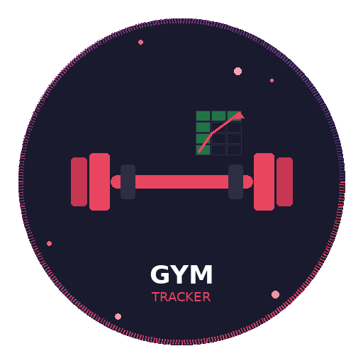

<div align="center">
  

  <h1>gym-tracker</h1>

  <p>
    An AI skill that turns your chaotic workout notes into a structured, auto-calculating Excel tracker — in under 2 minutes.
  </p>

  <p>
    
    
    
    
  </p>
</div>

---

## What it does

You tell the AI your workout program — days, exercises, sets and reps. The skill asks you a few questions and generates a complete, ready-to-use Excel file with:

- **Workout log** — sets, reps and weight for every exercise, every session
- **Automatic 1RM estimation** — Epley formula applied in real time
- **Load progression tracker** — session by session, per exercise
- **Volume per session** — total tonnage with rolling 3-session average
- **Personal Records log** — auto-calculated estimated 1RM for each PR
- **Progress charts** — visual load trend over time

No configuration. No formulas to write. Just talk to the AI.

---

## Available versions

| Language | File | Download |
|---|---|---|
| 🇮🇹 Italiano | `it/gym-excel-tracker-it.skill` | [Download](it/gym-excel-tracker-it.skill) |
| 🇬🇧 English | `en/gym-excel-tracker-en.skill` | [Download](en/gym-excel-tracker-en.skill) |

---

## How to install

### Claude (claude.ai)

> Compatible with Claude Sonnet and Claude Opus via claude.ai.

1. Download the `.skill` file for your language from the table above
2. Open [claude.ai](https://claude.ai) and go to **Settings**
3. Navigate to the **Skills** section
4. Click **Upload skill** and select the `.skill` file
5. Done — the skill is now active in your conversations

**To use it:** just type something like *"create a gym tracker for my workout program"* and follow the questions. Claude will ask about your schedule, exercises, and what you want to track — then generate the Excel file automatically.

---

### ChatGPT (via GPT Instructions)

> The `.skill` file contains structured instructions you can paste directly into a Custom GPT or a ChatGPT conversation.

**Option A — Paste into a conversation:**

1. Download the `.skill` file
2. Open it with any text editor (Notepad, TextEdit, VS Code)
3. Copy the entire content
4. Open [chat.openai.com](https://chat.openai.com)
5. Start a new conversation, paste the content and press Enter
6. Follow up with: *"Now create a gym tracker for my workout program"*

**Option B — Create a Custom GPT:**

1. Go to [chat.openai.com/gpts](https://chat.openai.com/gpts) → **Create**
2. Click **Configure**
3. Open the `.skill` file and copy its content
4. Paste it into the **Instructions** field
5. Save and publish your GPT
6. Use it directly from the GPT link anytime

> **Note:** ChatGPT cannot generate `.xlsx` files directly. It will produce a Python script using `openpyxl` that you can run locally, or a CSV you can open in Excel. For the best experience with automatic file generation, Claude is recommended.

---

## How the skill works

When you activate the skill, the AI walks you through 3 steps before generating anything:

**Step 1 — Schedule structure**
It asks how many training days you have: Full Body, A/B split, A/B/C, or A/B/C/D.

**Step 2 — What to track**
You choose what to monitor per exercise: sets/reps, weight, estimated 1RM, RPE/RIR notes, time under tension.

**Step 3 — Analytics features**
You pick the extra sheets you want: load progression, session volume, progress charts, personal records log, rolling average.

After that, you paste your exercise list — informally, exactly as you'd write it — and the skill generates a summary for you to confirm before producing the final file.

---

## Repo structure

```
gym-tracker/
├── assets/
│   └── gym-tracker-logo.png
├── it/
│   └── gym-excel-tracker-it.skill
├── en/
│   └── gym-excel-tracker-en.skill
└── README.md
```

---

## Requirements

| | Claude | ChatGPT |
|---|---|---|
| Account | claude.ai (free or Pro) | chat.openai.com (free or Plus) |
| Skills support | ✅ Native | ⚠️ Via instructions paste or Custom GPT |
| Auto `.xlsx` generation | ✅ Yes | ⚠️ Python script output |
| Interactive setup questions | ✅ Yes | ✅ Yes |

---

## Example output

The generated Excel includes up to 5 sheets depending on your selections:

| Sheet | Description |
|---|---|
| ℹ️ Instructions | How to use the file and update it week by week |
| 📋 Workout Log | Main log — date, sets, reps, weight per exercise |
| 📈 Load Progression | Weight tracked session by session per exercise |
| 📊 Session Volume | Total tonnage per session with chart |
| 🏆 Personal Records | PR log with auto-calculated estimated 1RM |

---

## Credits

Built by **Martino** — [@neuralcoffe](https://instagram.com/neuralcoffe) on Instagram.

Every week: one concrete AI skill or tool you can use the next day — not theory, not hype.

---

<div align="center">
  <sub>Open to contributions · Share freely</sub>
</div>
